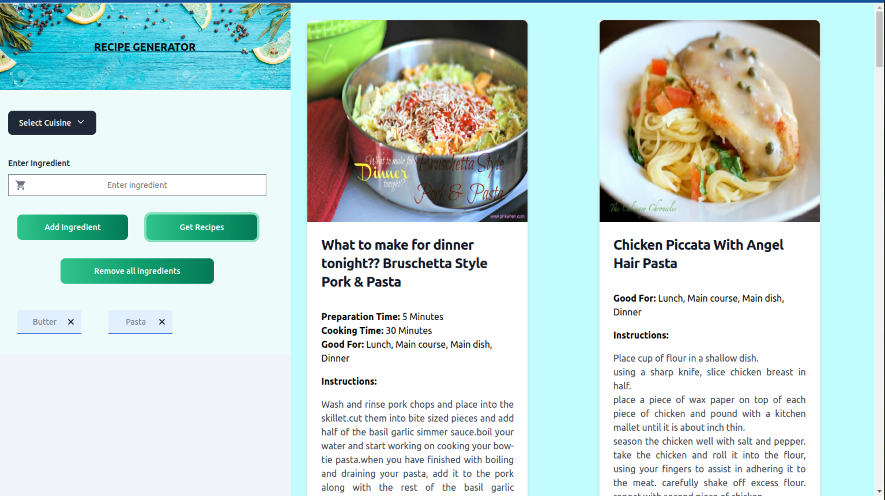

# Getting Started with Create React App

This project was bootstrapped with [Create React App](https://github.com/facebook/create-react-app). It used Flowbite React, Tailwind CSS for UI design.

## UI Screen

## Instructions to use the web application

- Select the cuisine from the list, the list also has an option to clear the selection. This input is optional.
- Enter the ingredient name and click on `Add Ingredient` button or press `Enter` button on the keyboard to add the ingredient. 
- To remove an individual ingredient, click on the `X` button on the corresponding ingredient.
- To clear all added ingredients click on `Remove all ingredients` button.
- Once the ingredients and cuisine is selected, click on `Get recipes` button to fetch the list of recipes
- The recipes and the details are displayed on the right along with allergy information like <b> Dairy, Gluten </b> and meal preferences like <b> Vegetarian, Vegan </b>

## Available Scripts

In the project directory, you can run:

### `npm start`

Runs the app in the development mode.\
Open [http://localhost:3000](http://localhost:3000) to view it in your browser.

The page will reload when you make changes.\
You may also see any lint errors in the console.

### `npm run build`

Builds the app for production to the `build` folder.\
It correctly bundles React in production mode and optimizes the build for the best performance.

The build is minified and the filenames include the hashes.\
Your app is ready to be deployed!

See the section about [deployment](https://facebook.github.io/create-react-app/docs/deployment) for more information.

